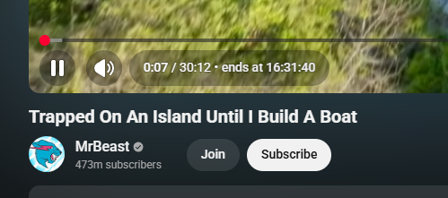

# YouTube Video Ends At for YouTube

[](https://github.com/GalvinPython/video-ends-at-youtube-extension/releases)
[](https://chromewebstore.google.com/detail/libjkhdmlojdijhlidcabicihlgnabnb)
[](https://microsoftedge.microsoft.com/addons/detail/oogfbgmodgilnnngmhljfjckkencejnd)

Stop guessing. Know exactly when your video ends.

YouTube Video Ends At adds a live `ends at HH:MM:SS` timestamp directly in the YouTube player so you can plan your next task, break, or meeting without doing mental math.



## Features

- Instant `ends at HH:MM:SS` timestamp beside YouTube's native timer.
- Real-time updates as the video progresses.
- Lightweight, fast, and focused.

## Known limitations

These are some issues I've determined whilst testing, but will be fixed in upcoming versions:

- Intended for regular YouTube watch pages (`/watch?v=...`) - some URLs/video contexts may not work
- Estimated end time is based on remaining video seconds and may feel off when playback speed is changed.

## Install

### Install from stores

- Chrome users: click the Chrome Web Store badge above.
- Edge users: click the Microsoft Edge Add-ons badge above.

### Install manually (unpacked)

1. Clone this repository.
2. Install dependencies:

   ```bash
   bun install
   ```

3. Build the extension files:

   ```bash
   bun run dist
   ```

4. Open your browser extension page:
   - Chrome: `chrome://extensions`
   - Edge: `edge://extensions`
5. Enable **Developer mode**.
6. Click **Load unpacked** and select the `dist` folder.

## How to use

1. Open a YouTube watch page (example: `https://www.youtube.com/watch?v=...`).
2. Start playing a video.
3. Look at the player time area for `• ends at HH:MM:SS`.
4. Plan your time better and stay in control of your watch session.

## Scripts

- `bun run dev`: Build in watch mode (minified) into `dist`.
- `bun run build`: Build content script only into `dist`.
- `bun run dist`: Copy manifest and generate icons, then build script.
- `bun run package:windows`: Build and create `builds/dist-<version>.zip`.
  - `bun run package:linux` for Linux/Bash

## Development

### Prerequisites

- [Bun](https://bun.sh) 1.3+
- Git
- Chrome or Microsoft Edge

### Local setup

1. Clone this repository.
2. Install dependencies:

   ```bash
   bun install
   ```

### Build and test locally

For active development:

```bash
bun run dev
```

For production build output:

```bash
bun run dist
```

### Load unpacked extension

1. Open your browser extensions page:
   - Chrome: `chrome://extensions`
   - Edge: `edge://extensions`
2. Enable **Developer mode**.
3. Click **Load unpacked**.
4. Select the `dist` folder.

### Packaging

Create a release zip:

On Windows/Powershell:

```bash
bun run package:windows
```

On Linux/Bash:

```bash
bun run package:linux
```

Output: `builds/dist-<version>.zip`

## Project structure

- `src/index.ts`: Main content script injected into YouTube pages.
- `src/manifest.json`: Chrome/Edge extension manifest.
- `src/copyToDist.ts`: Copies manifest and generates icon sizes.
- `src/console.ts`: Small scoped logger used by the content script.

## Contributing

Issues and pull requests are welcome. If you want to improve performance, UX text, or compatibility with YouTube UI updates, contributions are appreciated.

## License

[MIT](LICENSE)
